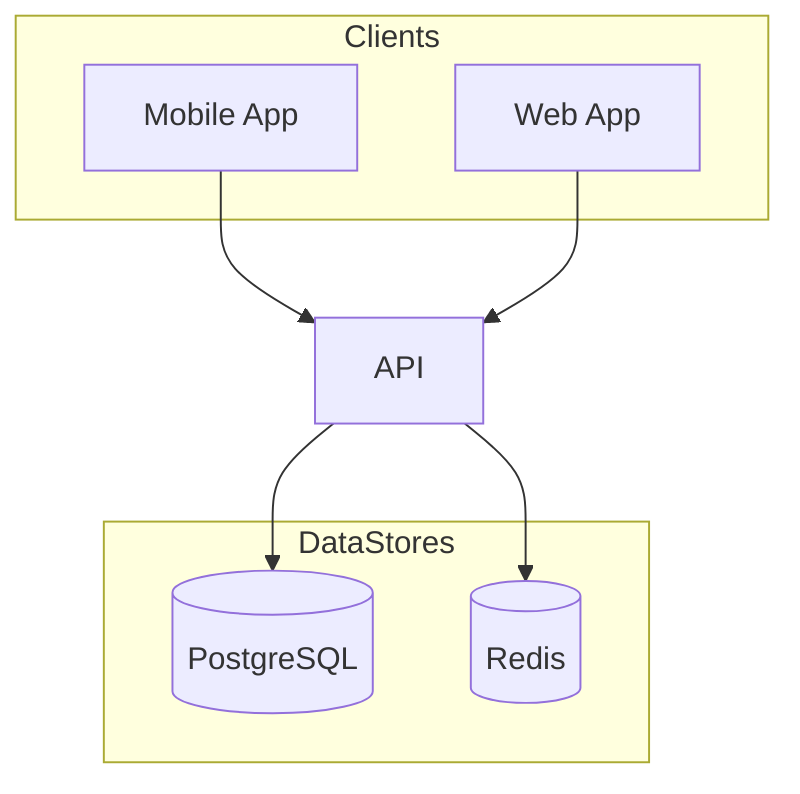
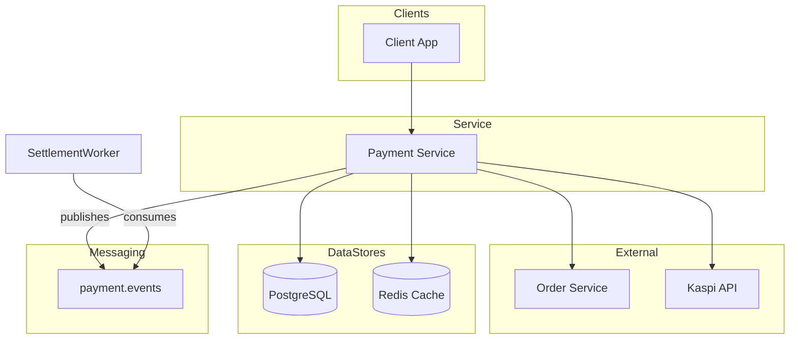
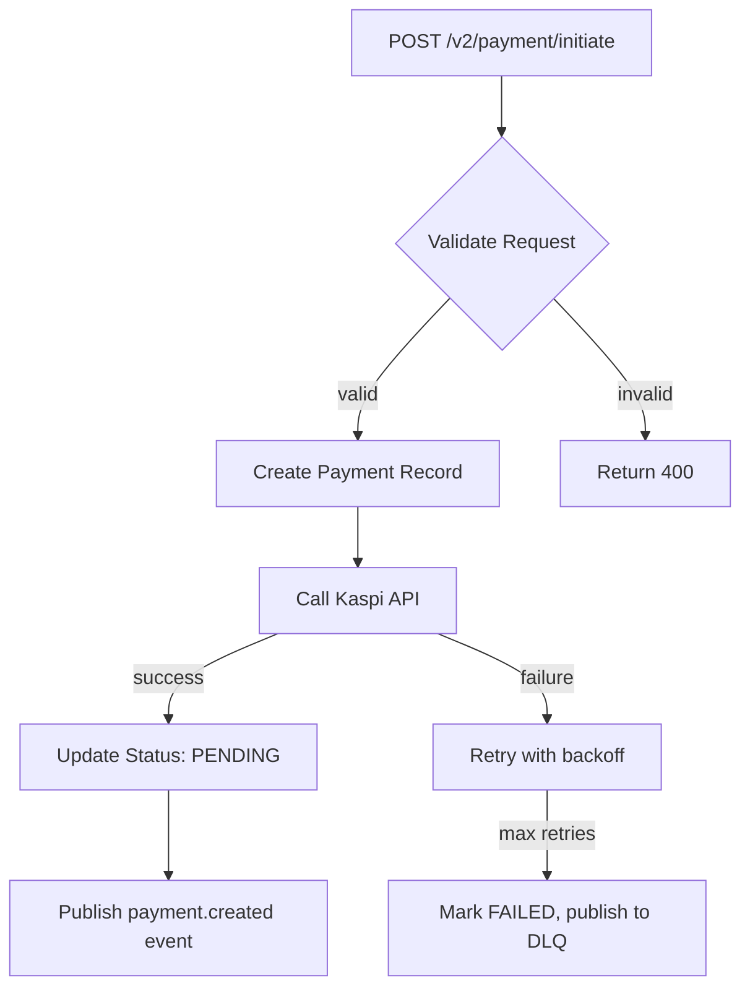
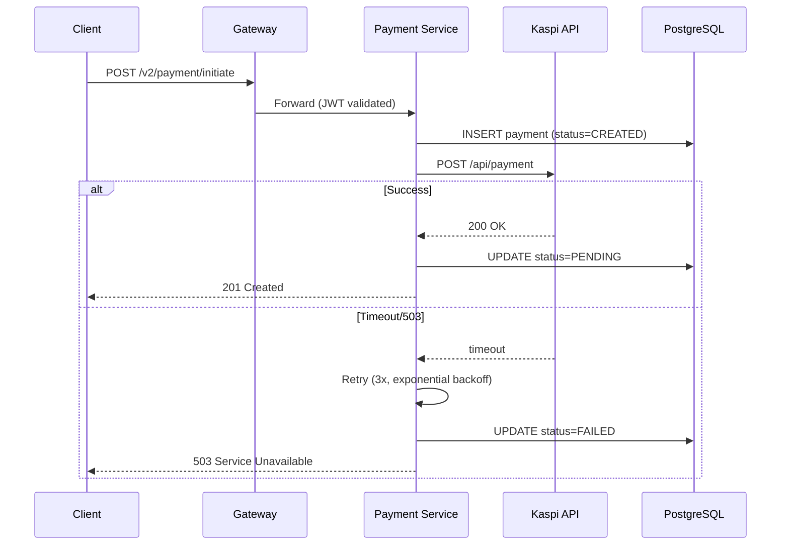
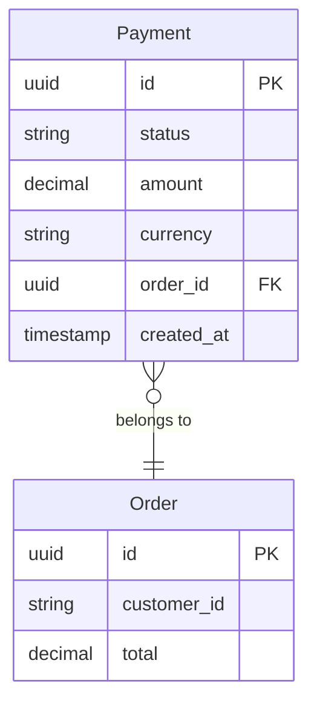
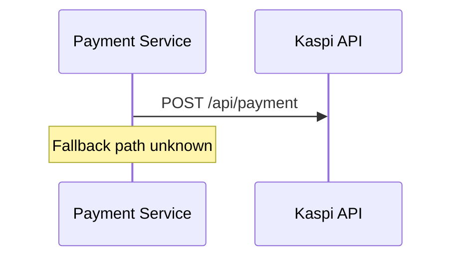

# Diagram Generation (Phase 6 of `init` pipeline)

All diagrams use **Mermaid syntax** embedded directly in Markdown. They must render
natively in MkDocs Material and on GitHub without plugins beyond `mkdocs-mermaid2`.

Only generate diagram types enabled in `repodoc.yaml` `diagrams.*` config.

---

## Diagram Layout & Complexity Rules

These rules apply to **all** diagram types below. Mermaid's auto-layout engine
can produce crossing/overlapping arrows on complex graphs. Follow these guidelines
to keep diagrams readable:

### Direction
- **Architecture overview:** use `graph TB` (top-to-bottom). `graph LR` causes
  excessive arrow crossings when there are many bidirectional connections.
- **Data flow:** use `flowchart TD` (top-down) — natural for request → process → response.
- **Sequence diagrams:** inherently top-down, no direction needed.

### Subgraph Grouping
Group related nodes into `subgraph` blocks. This helps Mermaid's layout engine
cluster nodes and route arrows more cleanly:

### Complexity Splitting
- If a diagram has **more than 12–15 nodes** or **more than 15–20 edges**, split
  it into multiple focused diagrams rather than one monolithic diagram.
- Each split diagram should cover one logical grouping (e.g. "Inbound traffic",
  "Data layer", "External integrations").
- Add a brief narrative paragraph between diagrams explaining how they relate.

### Node Ordering
Declare nodes in the order you want them laid out. Mermaid renders nodes in
declaration order, so listing `A`, `B`, `C` top-to-bottom in the source produces
a cleaner layout than random ordering.

---

## A — Architecture Overview

**File:** `<docs_site.output_dir>/architecture/overview.md`
**Diagram type:** `graph TB`

One high-level diagram for the whole service showing:
- This service (center)
- All external services it calls (outbound)
- All services that call it (inbound, if discoverable)
- All data stores (databases, caches, object storage)
- All event topics (Kafka, RabbitMQ, SQS)

Keep it high-level — one node per service/store/topic. Do not include internal
modules or classes. Use `subgraph` blocks to group related nodes (e.g. "Clients",
"Data Stores", "External Services"). Accompany with a narrative paragraph explaining
the system's place in the broader architecture.

---

## B — Data Flow Diagrams

**File:** `<docs_site.output_dir>/architecture/data-flow.md`
**Diagram type:** `flowchart TD`

One diagram **per major domain boundary** — from ingress (API call / event / cron
trigger) through internal transforms to egress (response / event publish / DB write).

Never create a single monolithic diagram. Identify distinct flows by:
- Each API endpoint group (payment creation, settlement, refund)
- Each event consumer pipeline
- Each batch/cron job

Each flow gets its own titled section and diagram.

---

## C — Sequence Diagrams

**File:** `<docs_site.output_dir>/architecture/sequence-diagrams.md`
**Diagram type:** `sequenceDiagram`

One diagram per major user-facing or integration flow. Include:
- Auth token exchange (if the flow involves authentication)
- Downstream service calls with request/response
- Error paths and retry behavior
- Async operations (event publish → consumer)

Each flow gets its own titled section with an anchor (e.g. `## Kaspi Payment Flow {#kaspi-payment-flow}`).

---

## D — Entity / Domain Model

**File:** `<docs_site.output_dir>/architecture/entity-model.md`
**Diagram type:** `erDiagram` or `classDiagram`

Use `erDiagram` for database-centric models (SQL schemas, ORM models).
Use `classDiagram` for domain objects and DTOs.

Show **key fields only** — not every column. Group by bounded context if applicable.

---

## Incomplete Diagrams

Where a diagram is incomplete because files were not read, render a partial diagram
and add a Mermaid comment indicating what is missing:

This keeps the diagram renderable while clearly signaling the gap.
